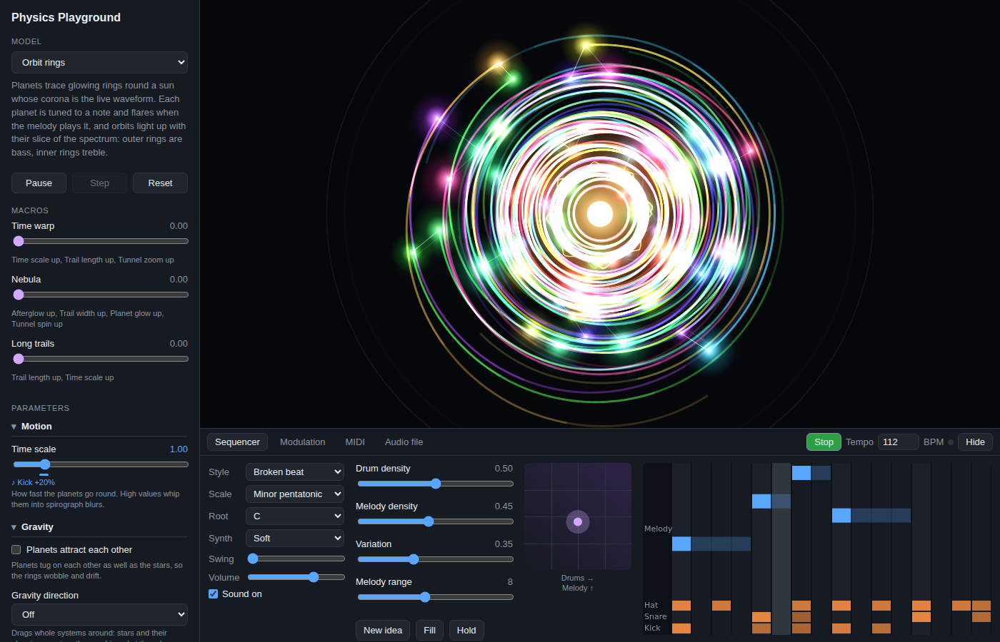

# Physics Playground

An interactive desktop app for exploring physics and algorithmic models on a live canvas. Pick a model, tweak its parameters with sliders, and poke at it with the mouse. Then play it like an instrument: a built-in generative sequencer, a MIDI controller, or a song can drive every model through notes, macros and modulation.



Built with [Tauri 2](https://tauri.app) (Rust shell, native webview) and TypeScript + Canvas 2D. macOS is the first target; Linux builds from the same code (`.deb`, AppImage, and a pacman package for Arch-based distros like CachyOS).

## Models

| Model | Category | Interaction |
| --- | --- | --- |
| Particles & gravity | Particle physics | Drag to fling a body, Shift for a heavy one |
| Orbits | Particle physics | Drag to launch a planet (with a trajectory preview), right-drag for a star |
| Cloth | Mechanics | Drag to pull the fabric, right-drag to slice it |
| Flocking (boids) | Algorithmic | Hold to attract, right-click or Shift to scatter |
| Reaction–diffusion | Algorithmic | Drag to seed chemical, right-drag to wipe |
| Chladni plate | Sound & music | Notes change the plate's vibration mode; drag to stir the sand |

Shift works in place of right-click everywhere. Several models have preset dropdowns (reaction patterns, colour schemes).

Keyboard: `Space` play/pause the simulation, `Enter` play/stop the sequencer, `R` reset, `.` single step while paused.

## Music

The panel under the canvas has four tabs.

- **Sequencer**: a generative drum machine and melody. Instead of programming steps, you steer it: **Drum density** adds hits to the drum pattern (from a bare backbone up to ghost notes and rolls), **Melody density** fills the melody in with more notes, **Variation** sets how much the pattern evolves each bar and how often it plays a fill, and **Melody range** sets how far the melody wanders. The XY pad sets both densities at once with one drag. **New idea** starts a fresh pattern, **Fill** plays a fill at the end of the bar, and **Hold** freezes the pattern. Pick a drum style (broken beat, four on the floor, half-time, ambient), a scale and root, and swing. The view shows the bar that's playing. It plays through a small built-in synth (or silently, with Sound off) and sends every hit to the current model.
- **Modulation**: routes that let a music source push a slider. Sources are note envelopes (any note, kick, snare, hat, melody), last velocity and pitch, held MIDI notes, tempo-synced LFOs, audio levels (overall, bass, mids, treble), the mod wheel, pitch bend and any MIDI CC. Targets are the model's number sliders and its macros. A coloured bar under a slider shows how far it's being pushed.
- **MIDI**: pick input devices, play notes through the synth, and map knobs with MIDI learn (click MIDI learn, click a slider or macro, turn a knob). Macro and sequencer mappings carry across models, so a knob can ride the drum or melody density live.
- **Audio file**: play a song; its levels become modulation sources and its kick drums trigger note reactions.

Every model reacts to notes in its own way (notes drop bodies, pluck the cloth, seed reaction spots, retune the Chladni plate, and so on), coloured by pitch where it has colour. Each model also has a few **macros**: single 0..1 knobs that push several parameters at once. Routes and macro settings are saved per model.

MIDI goes through the Rust side ([`src-tauri/src/midi.rs`](src-tauri/src/midi.rs), using `midir`) because the Linux and macOS webviews don't support Web MIDI. Messages reach the UI as `midi-message` events. On Linux that needs ALSA (`alsa-lib` on Arch, `libasound2-dev` to build on Debian/Ubuntu). In a plain browser (`npm run dev`) the app falls back to Web MIDI where the browser has it.

## Running it

Prerequisites: Node 20+, Rust (stable, via [rustup](https://rustup.rs)), and the [Tauri system dependencies](https://tauri.app/start/prerequisites/) for your OS (on macOS that's just Xcode Command Line Tools: `xcode-select --install`).

```sh
npm install
npm run tauri dev     # desktop app with hot reload
npm run dev           # or just the UI in a browser at http://localhost:1420
```

Build a distributable:

```sh
npm run tauri build   # macOS: .app + .dmg   Linux: .deb + .AppImage
```

On Linux, install the webview deps first:

```sh
# Debian / Ubuntu
sudo apt install libwebkit2gtk-4.1-dev libappindicator3-dev librsvg2-dev patchelf libasound2-dev

# Arch / CachyOS / EndeavourOS / Manjaro
sudo pacman -S --needed base-devel webkit2gtk-4.1 librsvg alsa-lib rust nodejs npm
```

## Installing on Arch-based distros (CachyOS, EndeavourOS, Manjaro)

### Build a pacman package (recommended)

The repo ships a [`PKGBUILD`](packaging/arch/PKGBUILD) that builds the app from your checkout and installs it like any other package, with a launcher entry and icon.

```sh
sudo pacman -S --needed base-devel git
git clone https://github.com/thomas-nelson23/physics-playground.git
cd physics-playground/packaging/arch
makepkg -si
```

`makepkg -s` pulls in everything it needs (Rust, Node, `webkit2gtk-4.1`). If you already use `rustup`, that works too. Then launch **Physics Playground** from your app menu, or run `physics-playground`.

- Update: `git pull`, then `makepkg -sif` in `packaging/arch`.
- Uninstall: `sudo pacman -R physics-playground`.

The repo is private, so `git clone` needs you signed in to GitHub (for example `gh auth login`, or clone over SSH).

### Download a prebuilt package

Every push to `main` builds an Arch package in CI.

1. Open the repo's **Actions** tab, pick the latest **Build** run on `main`, and download the `physics-playground-arch` artifact.
2. Unzip it and install:

   ```sh
   sudo pacman -U physics-playground-*.pkg.tar.zst
   ```

### AppImage (no install)

The `physics-playground-Linux` artifact from the same run contains an AppImage that runs without installing anything. It needs FUSE 2:

```sh
sudo pacman -S --needed fuse2
chmod +x Physics*.AppImage
./Physics*.AppImage
```

The AppImage is built on Ubuntu and bundles its own libraries, so the pacman package is the better fit on Arch.

### Troubleshooting

- **Blank or white window, or a crash on start (common with NVIDIA drivers):** the app now sets `WEBKIT_DISABLE_DMABUF_RENDERER=1` itself on Linux, so this should not happen. If you need the DMA-BUF renderer back, launch with `WEBKIT_DISABLE_DMABUF_RENDERER=0 physics-playground`.

## Adding a model

Every model implements `SimulationModel` from [`src/models/types.ts`](src/models/types.ts). The host app owns the canvas, the fixed-timestep loop, the parameter sliders and pointer routing, so a model only describes its parameters and implements `reset`, `step` and `render` (plus optional `onPointer`, `onNote`, `resize` and `stats`).

1. Create `src/models/myModel.ts` exporting a `ModelDefinition`:

   ```ts
   import type { ModelDefinition, SimulationModel } from "./types";

   class MyModel implements SimulationModel {
     reset(view, params) { /* build state */ }
     step(dt, params) { /* advance state by dt seconds */ }
     render(g, view, params) { /* draw with the 2D context */ }
   }

   export const myModel: ModelDefinition = {
     id: "my-model",
     name: "My model",
     category: "Custom",
     description: "What it shows.",
     params: [
       { kind: "number", key: "strength", label: "Strength", min: 0, max: 10, step: 0.1, default: 1 },
     ],
     create: () => new MyModel(),
   };
   ```

2. Add it to the list in [`src/models/registry.ts`](src/models/registry.ts).

Sliders, checkboxes and dropdowns (`kind: "choice"`) are generated from `params` automatically. Mark a param `resetOnChange: true` if changing it should rebuild the simulation (e.g. a particle count).

To make a model musical:

- Implement `onNote(note, params)`. A `NoteEvent` has the MIDI `note`, `velocity` (0..1), a `role` (`"kick"`, `"snare"`, `"hat"` or `"tone"`) and `x`, the note's place in its range from 0 (lowest) to 1 (highest), handy as a left-to-right position. `noteHue` in `models/lib/music.ts` gives a consistent colour per pitch.
- Add `macros`: each is a 0..1 knob with `targets: [{ param, amount }]`, where `amount` is a fraction of that param's range.
- Add default `modulations`, e.g. `{ source: "kick", target: "strength", amount: 0.2 }`, so music does something before anyone opens the Modulation tab.

Number params without `resetOnChange` can be modulated; the model always receives the modulated values in `params`.

## Project layout

```
src/
  main.ts            app shell: canvas, loop, input, model switching
  models/
    types.ts         the model interface
    registry.ts      list of available models
    particles.ts     n-body gravity + collisions
    orbits.ts        stars and planets (leapfrog integrator)
    cloth.ts         Verlet cloth with tearing
    boids.ts         flocking
    reaction.ts      Gray-Scott reaction-diffusion
    chladni.ts       Chladni figures on a vibrating plate
    lib/raster.ts    pixel buffer + palettes for grid models
    lib/music.ts     note colours and helpers for musical models
  music/
    studio.ts        music panel: sequencer UI, routes, MIDI learn, audio file
    sequencer.ts     generative drums and melody with lookahead scheduling
    audio.ts         drum kit, synth, file player, band analyser
    modulation.ts    modulation sources and how they combine with sliders and macros
    midi.ts          MIDI input (Tauri events, or Web MIDI in a browser)
  ui/controls.ts     builds parameter controls from a model's spec
src-tauri/           Rust/Tauri desktop shell, bundle config and MIDI input
```
